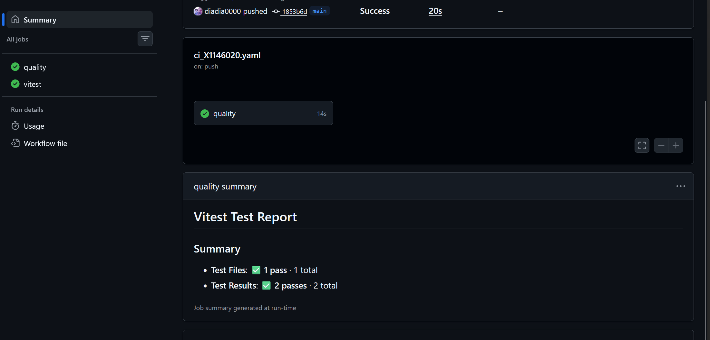
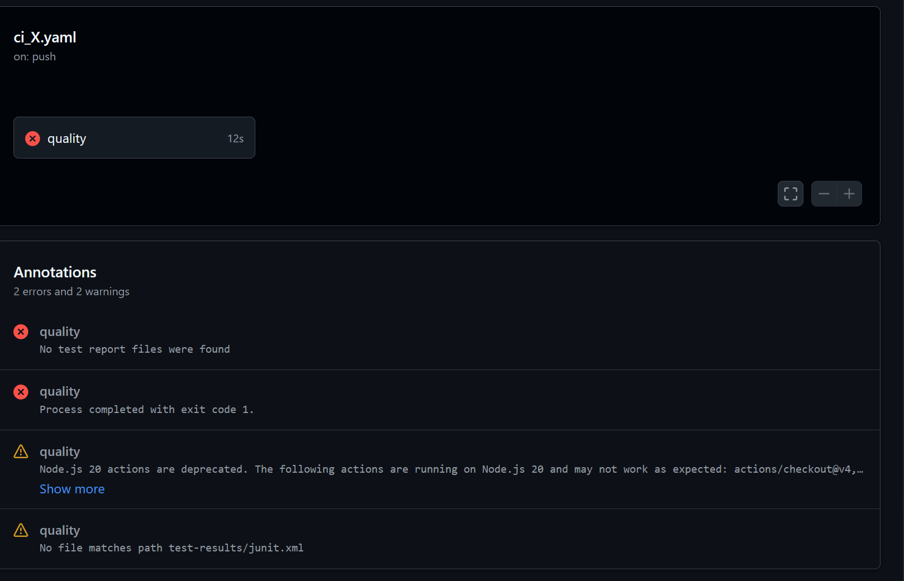
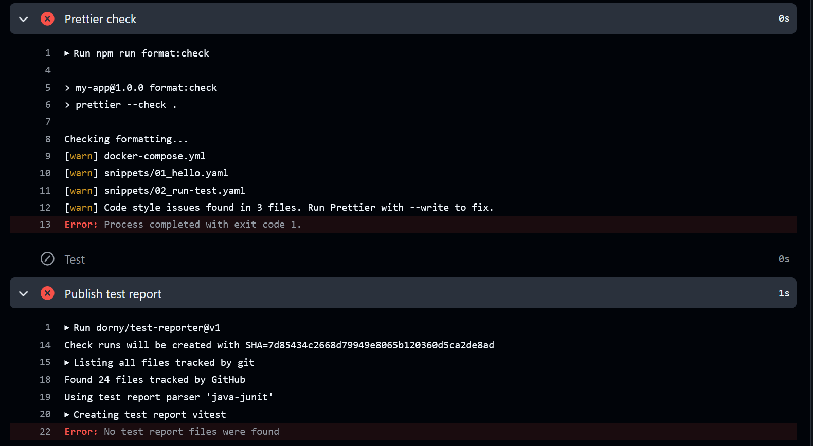

# CICD lab HW
url: [cicd-lab](https://github.com/diadia0000/cicd-lab)
## CI pipline

```yml
name: myci

on:
  push:

permissions:
  contents: read
  checks: write

jobs:
  quality:
    runs-on: ubuntu-latest
    steps:
      - name: Checkout
        uses: actions/checkout@v4

      - name: Setup Node
        uses: actions/setup-node@v4
        with:
          node-version: 22
          cache: npm

      - name: Install dependencies
        run: npm ci

      - name: TypeScript typecheck
        run: npm run typecheck

      - name: Prettier check
        run: npm run format:check

      - name: Test
        run: npm test

      - name: Publish test report
        if: always()
        uses: dorny/test-reporter@v1
        with:
          name: vitest
          path: test-results/junit.xml
          reporter: java-junit
          fail-on-error: false
```

我的pipline配置了以下步骤：

1. Checkout代码
2. 設定Nodejs 22版本環境
3. 安装nodejs 套件
4. TypeScript型態檢查，查看是否有型態錯誤
5. Prettier格式檢查，是否有符合Typescript的格式
6. 測試，執行測試腳本，並產生測試報告
7. 發布測試報告方便驗證結果跟debug

## 成功圖



## 失敗圖




### 失敗案例說明

我故意不修正snippets資料夾的格式，讓 Prettier check 失敗。  
錯誤原因：`prettier --check .` 顯示 `docker-compose.yml` 與 `snippets/*.yaml` 有格式問題，且沒有repo的讀寫權限。
修正方式：
     - 執行 `npm run format`重新格式化後再 push
     - 在 workflow 中增加 `contents: read` `checks: write` 的權限，讓 workflow 可以讀取 repo 的內容。
